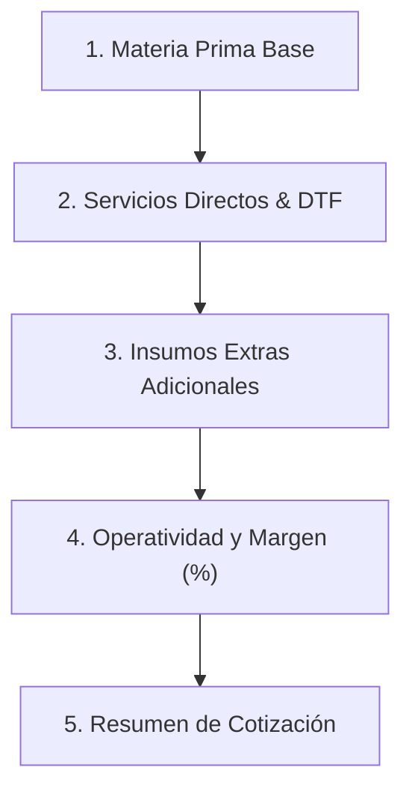
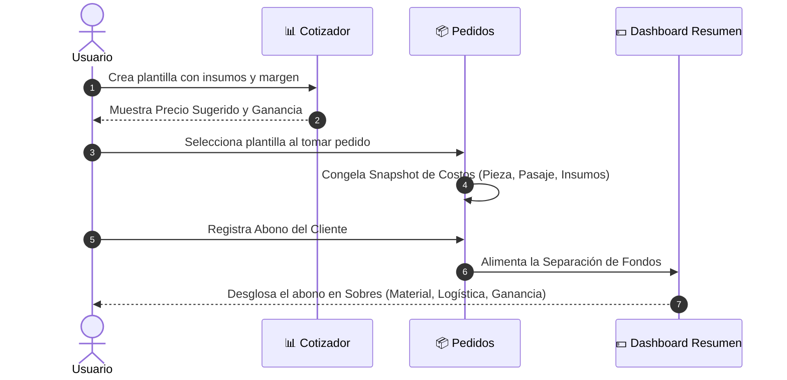

# 📊 Manual Maestro del Cotizador Inteligente - Zubli App

> [!IMPORTANT]
> Este documento contiene la guía técnica, contable y de usuario completa sobre el motor central de cotización de **Zubli**. Está diseñado para explicar la matemática financiera, el flujo de producción y la operación práctica para talleres de sublimación, confección textil, corte láser, grabado y regalos personalizados.

---

## 📄 Tabla de Contenidos
1. [La Filosofía Financiera: Fórmula del Margen Real](#1-la-filosofía-financiera-fórmula-del-margen-real)
2. [Estructura del Formulario en 5 Secciones](#2-estructura-del-formulario-en-5-secciones)
3. [El Sistema Lote / Paquete (Cero Calculadora)](#3-el-sistema-lote--paquete-cero-calculadora)
4. [Insumos Dinámicos e Ilimitados (Estilo Bloques de Lego)](#4-insumos-dinámicos-e-ilimitados-estilo-bloques-de-lego)
5. [Cajero Inteligente de Tarifas al Mayor](#5-cajero-inteligente-de-tarifas-al-mayor)
6. [Flujo de Datos: Del Cotizador al Resumen Financiero](#6-flujo-de-datos-del-cotizador-al-resumen-financiero)
7. [Guía Paso a Paso para Principiantes](#7-guía-paso-a-paso-para-principiantes)

---

## 1. La Filosofía Financiera: Fórmula del Margen Real

El motor de Zubli no utiliza estimaciones improvisadas. Aplica la **fórmula contable industrial de margen sobre venta**, evitando que el emprendedor pierda dinero al otorgar descuentos o pagar comisiones.

### 🔴 El "Error del Principiante" (Markup o Recargo sobre Costo)
Muchos emprendedores creen que si un producto les cuesta **$10.00 USD** y quieren ganarse el **50%**, deben multiplicar por `1.50`:
$$\text{Precio Incorrecto} = \$10.00 \times 1.50 = \$15.00 \text{ USD}$$

* **El Peligro:** Si venden en $15.00 y les costó $10.00, ganan $5.00. Pero $\$5.00 \div \$15.00 = 0.333$. **Solo están ganando el 33.3% real del dinero que entra a su caja**. Si otorgan un 20% de descuento o pagan impuestos, su ganancia desaparece.

### 🟢 La Fórmula Oficial de Zubli (Margen sobre Venta)
Zubli utiliza la fórmula de división financiera:
$$\text{Precio de Venta Sugerido} = \frac{\text{Costo Total de Producción}}{1 - \text{Margen Deseado en Decimal}}$$

#### Ejemplo con $12.00 de Costo y 40% de Ganancia Deseada:
1. Convierte el 40% a decimal: `0.40`.
2. Resta a 1: $1 - 0.40 = 0.60$.
3. Divide el costo entre el remanente:
$$\text{Precio Sugerido} = \frac{\$12.00}{0.60} = \mathbf{\$20.00 \text{ USD}}$$

#### Comprobación de Caja:
* Cobras al cliente: **$20.00 USD**.
* Restas tu costo de producción: **$12.00 USD** (va al sobre de reposición de materiales).
* Te quedan limpios en el bolsillo: **$8.00 USD**.
* **Comprobación:** $\$8.00 \div \$20.00 = \mathbf{0.40}$ ➔ **¡El 40% exacto de cada billete que cobraste es tu ganancia libre!**

> [!TIP]
> **El Costo Operativo (% Luz / Merma / Desgaste):**
> Zubli añade automáticamente un porcentaje operativo (por defecto 10%) sobre los materiales antes de calcular el margen. Esto cubre el desgaste de planchas, impresoras, electricidad y mermas por errores de producción.

---

## 2. Estructura del Formulario en 5 Secciones

El formulario de edición de plantillas en Zubli está organizado en una secuencia intuitiva del 1 al 5:

| Sección | Nombre | Componentes e Insumos Incluidos |
| :--- | :--- | :--- |
| **Sección 1** | **Materia Prima (Base)** | Pieza principal (Franela, Taza, Gorra), Empaque (Caja/Bolsa) y Resma de Papel de sublimación. |
| **Sección 2** | **Servicios Directos** | Impresión DTF por metro, Flete/Transporte y Servicio de Diseño Gráfico. |
| **Sección 3** | **Insumos Extras Adicionales** | Lista dinámica e ilimitada de accesorios (Imanes, Resina, Cintas, Llaveros, Cajas especiales, etc.). |
| **Sección 4** | **Operatividad y Margen (%)** | Control deslizable de **Luz/Merma (0% a 50%)** y **Margen de Ganancia Libre (0% a 99%)**. |
| **Sección 5** | **Resumen de Cotización** | Tarjeta gigante con el Costo de Producción Total, Precio Sugerido y Ganancia Libre Neta por pieza. |

---

## 3. El Sistema Lote / Paquete (Cero Calculadora)

Zubli elimina la necesidad de sacar cuentas externas con calculadoras al momento de comprar mercancía al mayor.

### Funcionamiento:
Cuando compras insumos a tu proveedor, usualmente vienen en paquetes o cajas. Copias directamente los datos de tu factura:

* **Ejemplo 1 (Caja de Tazas):** Factura de proveedor: *$45.00 por caja de 36 tazas*.
  * Pones en Zubli: Precio Lote = `45.00` | Piezas Rinde = `36`.
  * **Zubli calcula:** `$1.25 USD` por taza.
* **Ejemplo 2 (Bulto de Franelas):** Factura: *$48.00 por bulto de 12 franelas*.
  * Pones en Zubli: Precio Lote = `48.00` | Piezas Rinde = `12`.
  * **Zubli calcula:** `$4.00 USD` por franela.
* **Ejemplo 3 (Pieza Única al Detal):**
  * Pones en Zubli: Precio Lote = `5.00` | Piezas Rinde = `1`.
  * **Zubli calcula:** `$5.00 USD` por pieza.

---

## 4. Insumos Dinámicos e Ilimitados (Estilo Bloques de Lego)

En la **Sección 3**, el usuario puede presionar el botón **`➕ Agregar Insumo Extra`** para incluir cualquier número de materiales sin límite.

### Clasificación por Categorías (Para los Sobres del Resumen):
Cada insumo agregado dinámicamente se clasifica en una de 3 categorías para alimentar automáticamente la contabilidad del Dashboard:

1. 📦 **Base (Materia Prima):** Rígidos, textiles o artículos base.
2. 🖨️ **Insumo:** Consumibles de imprenta, empacado o acabados (resina, cajas, cintas).
3. 🚚 **Servicio:** Envíos, cortes láser, bordados o digitalizaciones.

---

## 5. Cajero Inteligente de Tarifas al Mayor

Zubli permite crear plantillas específicas marcadas como tarifas al mayor para adaptar automáticamente los precios según el volumen del pedido.

### Configuración en el Cotizador:
* Marcar la casilla: **`[x] 🏷️ Es Tarifa de Venta al Mayor`**.
* Establecer el umbral: **Aplica a partir de cuántas piezas:** `[ 6 ]` (o 12, 24, 50, etc.).

### Detección Automática en Pedidos:
1. Al anotar un pedido para un cliente y seleccionar el producto (ej. *"Franela de Algodón"*):
2. Si colocas **Cantidad: 2** ➔ Zubli aplica la tarifa al detal.
3. Apenas cambies la **Cantidad a 6** (o superes el umbral) ➔ Zubli detecta la plantilla al mayor, ajusta automáticamente el precio unitario y la estructura de costos, y muestra la etiqueta verde:
$$\text{🏷️ ¡Tarifa al Mayor Aplicada! } (\ge 6 \text{ pcs})$$

---

## 6. Flujo de Datos: Del Cotizador al Resumen Financiero

Toda cotización creada en Zubli fluye directamente hacia el control transaccional del taller:

> [!NOTE]
> **Congelamiento de Costos (Snapshot):**
> Al guardar un pedido, Zubli congela los costos de producción de esa fecha dentro del registro. Si en el futuro editas la plantilla en el Cotizador porque subieron los insumos, los pedidos viejos mantendrán su contabilidad histórica intacta.

---

## 7. Guía Paso a Paso para Principiantes

### Paso 1: Crear tu Primera Plantilla
1. Ve a la pestaña **Cotizar** (ícono de etiqueta abajo).
2. Presiona **`+ Nueva Plantilla`**.
3. Escribe el Nombre (ej. *"Taza Mágica 11oz"*).
4. En **Sección 1**, coloca el precio de la caja de tazas y las piezas que trae.
5. En **Sección 2**, coloca si usas DTF, diseño o transporte.
6. En **Sección 3**, presiona **`➕ Agregar Insumo Extra`** si lleva caja de regalo o imán.
7. En **Sección 4**, ajusta la barra de **Luz/Merma (10%)** y **Margen de Ganancia Libre (40%)**.
8. Presiona **`Guardar Plantilla`**.

### Paso 2: Usar la Cotización en un Pedido
1. Ve a **Pedidos** y presiona **`+ Nuevo Pedido`**.
2. En el buscador de producto, empieza a escribir *"Taza Mágica"*.
3. Toca la sugerencia: Zubli autocompletará el precio sugerido y todos sus costos de producción en 1 segundo.
4. Indica la cantidad y guarda el pedido.

---

*Manual generado para la aplicación Zubli - Gestión de Negocios y Cotización Inteligente.*
